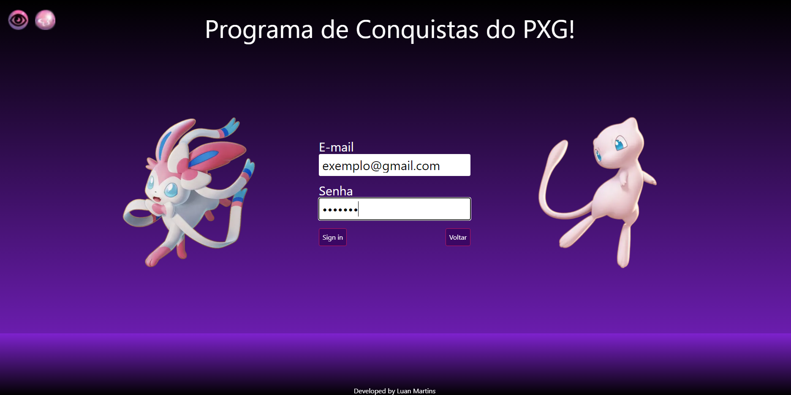

<h2> Projeto de Tabela de Farm para o PXG</h2>

* Farei um resumo de como o programa funciona e para o que ele foi idealizado

<h3>Contextualização</h3>
Eu criei esse programa para me ajudar a ter controle dos meus lucros em um jogo de pokemon chamado PXG, no jogo há diversos clans que são responsaveis pelos dar bonus as tipagens de pokemons exemplo o clan volcanic ganha bonus de ataque e defesa para seus pokemons que são do tipo fogo, no meu caso eu sou psycraft ou seja eu tenho bonus de ataque e defesa para pokemons do tipo psychic e fada.
Entao baseado nessas informações existem lugares de caça para todos os clans, no meu caso eu caço em hunts que os meus pokemons batem efetivo ou seja, lutador/noturno entao eu criei esse programa para me ajudar a ter o controle dos ganhos que faço. 

<h3>Como ele funciona na pratica?</h3>
Basicamente eu criei um acesso de login e senha e toda a estrutura está presente em um banco de dados este atualmente está fisico mas futuramente pretendo por ele na nuvem, fazendo o login o usuario terá acesso a três abas que serão Pokemons, Conquistas e a Tabela de Farm, a Parte de Pokemons e Conquista ainda está em construção, mas na parte de pokemon basicamente o jogador poderá salvar seu time ali para ficar exposto, na parte de Conquista eu coloquei para que o mesmo possa colocar o que o mesmo comprou no mes e ter o controle mensalmente, a Tabela de farm é responsavel por mostrar o dia, o local de caça e o total farmado dos dados que o usuario inserir. 

<h3>O programa na prática</h3>
Aqui colocarei imagens de cada pagina para contextualização

Aqui é a tela de inicio do programa, onde se o usuário ja estiver cadastro ele pode fazer o login ou se ainda não estiver cadastrado o mesmo pode se cadastrar.

A página de registro onde o usuário poderá fazer o cadastro do mesmo.

Após o mesmo ser cadastrado será redirecionado para a pagina de login.

Após fazer o login o mesmo será redirecionado para a pagina principal, lembrando que as paginas pokémons e conquistas ainda estão em construção.

Ao clicar na opção de Tabela de Farm para um novo usuário assim se apresentará a tabela, vazia pois o mesmo ainda não adicionou nenhum dados na mesma.

Ao clicar na opção adicionar irá abri a primeira modal, para o usuário selecionar a hunt (local onde o mesmo caçou). (lembrando que o programa até o momento só irá monstrar as hunts respectivas ao clan psycraft)

Drop de Itens de Machamp

Drop de Itens de Persian

Drop de Itens de Gallade

Drop de Itens de Dragonite e Garchomp

Após selecionar uma hunt e clicar no botão enviar será mostrado ao usuario todos os itens que os monstros presentes naquela hunt possui, então caberá ao mesmo informar a quantidade de itens que o mesmo conseguiu para que o sistema possa somar e colocar os dados na tabela.

Após o usuário inserir os dados a tabela trará os dados do mesmo e monstrará o resultado que será salvo no banco de dados, também será exibido o valor total da soma dos dados colocados na tabelá na parte inferior direita. 

Também possui o botão logout para o mesmo se deslogar.
Lembrando que cada usuário terá a sua propria informações no banco de dados, foi construido uma tabela somente, mas como cada usuario tem seu userID setado ao logar, o programa sabe qual dados trazer e também salvar baseado no userID do usuário.

